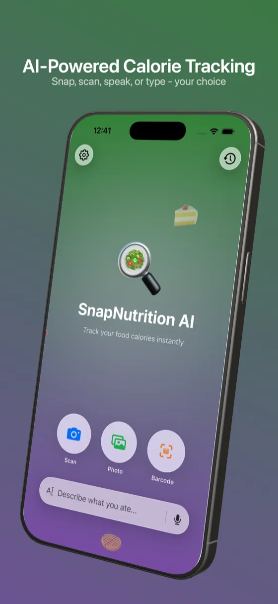
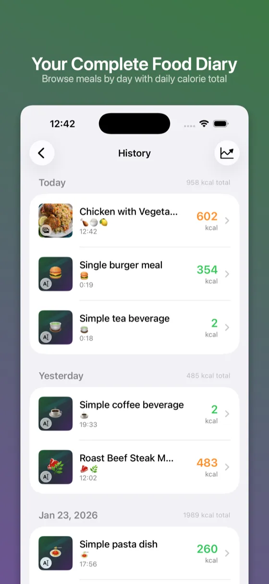
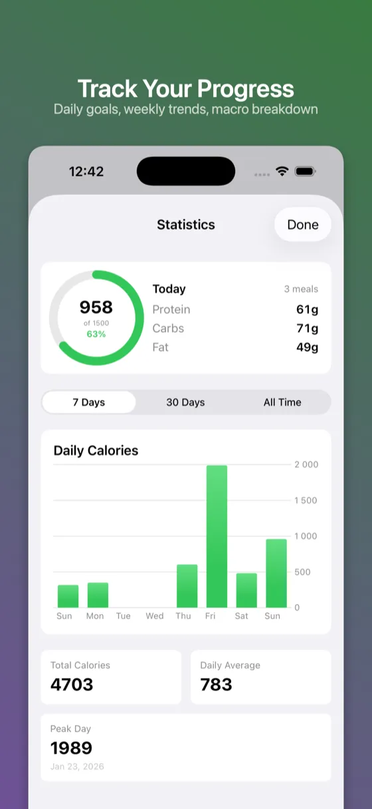

# SnapNutrition AI

The best free AI calorie tracker for iPhone, iPad, and Apple Watch. No subscription, no ads, no limits. BYOK (Bring Your Own Key) — use your own Anthropic or OpenAI API key and pay only for what you use.

  

## What is SnapNutrition AI?

SnapNutrition AI lets you track calories and nutrition instantly using AI. Simply snap a photo of your food, scan a barcode, type, or speak — and get instant calorie and macro estimates. Log calories from your wrist with the Apple Watch app, or track at a glance with Home Screen, Lock Screen, and Control Center widgets.

**Completely free.** You bring your own API key (Anthropic Claude or OpenAI GPT) and pay only for what you use — typically just pennies per scan.

## Features

- **Photo Scanning** — Take a photo, get instant nutrition info
- **Barcode Scanner** — Scan packaged foods for accurate data
- **Voice Input** — Speak what you ate, hands-free
- **Text Input** — Type a description for AI analysis
- **Macro Tracking** — Track protein, carbs, and fat
- **Daily Goals** — Set and monitor calorie targets
- **Statistics** — View daily, weekly, and all-time progress
- **Apple Watch App** — Voice logging, daily calorie summary, macro rings, and complications
- **Widgets** — Home Screen, Lock Screen, and Control Center quick actions for calorie tracking at a glance
- **iCloud Sync** — Seamless sync across all Apple devices
- **8 Languages** — English, Ukrainian, Polish, French, Spanish, German, Czech, Italian
- **Privacy First** — No account required, no backend servers, all data stays on your device

## Screenshots

  
  
  

## Download

<a href="https://apps.apple.com/us/app/snapnutrition-ai/id6757797704">Download SnapNutrition AI on the App Store</a> — requires iOS 17.0+ / watchOS 10.0+.

## Links

- **Website:** [snapnutritionai.app](https://snapnutritionai.app)
- **Privacy Policy:** [snapnutritionai.app/privacy](https://snapnutritionai.app/privacy.html)

## Why Free?

Unlike other calorie trackers that charge $5–15/month, SnapNutrition AI has no subscription fees. You use your own AI API key (Anthropic or OpenAI) and pay only for actual usage — a few cents per day for most users.

---

Made by [Unibrix](https://unibrix.com)
