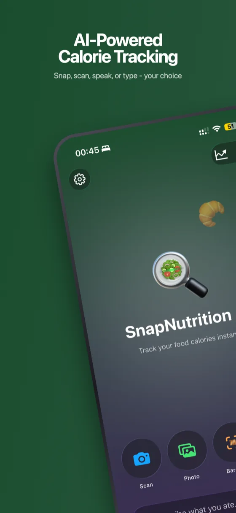
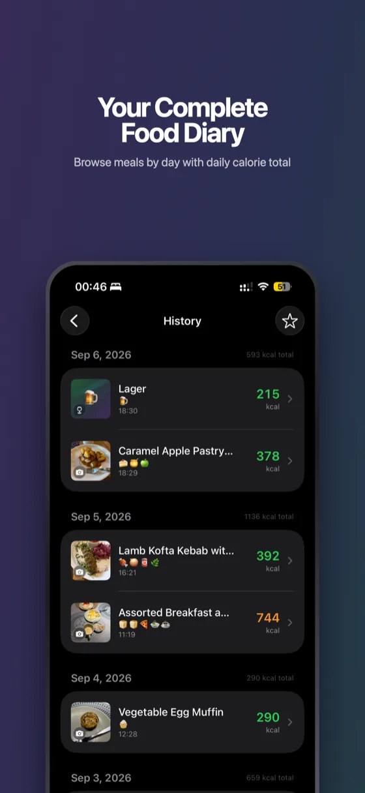
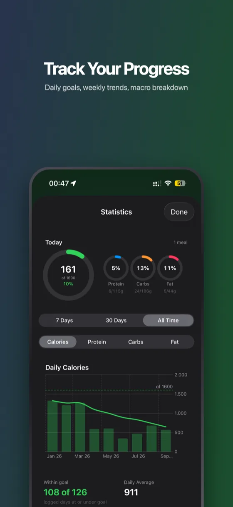

# SnapNutrition AI

An AI calorie tracker for iPhone, iPad, and Apple Watch with no mandatory subscription or ads. BYOK (Bring Your Own Key) supports Google Gemini, OpenAI, Anthropic, and OpenRouter; optional Auto Mode is available for people who prefer not to manage an API key.

  

## What is SnapNutrition AI?

SnapNutrition AI lets you track calories and nutrition instantly using AI. Simply snap a photo of your food, scan a barcode, type, or speak — and get instant calorie and macro estimates. Log calories from your wrist with the Apple Watch app, or track at a glance with Home Screen, Lock Screen, and Control Center widgets.

The app has no mandatory subscription. In BYOK mode, you connect your own Google Gemini, OpenAI, Anthropic, or OpenRouter key. Gemini and OpenRouter offer free tiers; paid providers bill you directly for usage. Optional Auto Mode costs $2.99/month or $29.99/year after a 3-day trial.

## Features

- **Photo Scanning** — Take a photo, get instant nutrition info
- **Barcode Scanner** — Scan packaged foods for accurate data
- **Voice Input** — Speak what you ate, hands-free
- **Text Input** — Type a description for AI analysis
- **Macro Tracking** — Track protein, carbs, and fat
- **Daily Goals** — Set and monitor calorie targets
- **Statistics** — View daily, weekly, and all-time progress
- **Apple Watch App** — Voice logging, daily calorie summary, macro rings, and complications
- **Widgets** — Home Screen, Lock Screen, and Control Center quick actions for calorie tracking at a glance
- **iCloud Sync** — Seamless sync across all Apple devices
- **11 Languages** — English, Ukrainian, Polish, French, Spanish, German, Czech, Italian, Finnish, Danish, Dutch
- **Privacy First** — No SnapNutrition account; BYOK has no SnapNutrition backend, while Auto Mode uses a minimal proxy and never stores food photos

## Screenshots

  
  
  

## Download

<a href="https://apps.apple.com/us/app/snapnutrition-ai/id6757797704">Download SnapNutrition AI on the App Store</a> — requires iOS 17.6+ / watchOS 10.0+.

## Links

- **Website:** [snapnutritionai.app](https://snapnutritionai.app)
- **Privacy Policy:** [snapnutritionai.app/privacy](https://snapnutritionai.app/privacy.html)
- **AI tracker comparison:** [Best Free AI Calorie Tracker Apps in 2026](https://snapnutritionai.app/best-free-ai-calorie-tracker-apps-2026.html)
- **Privacy-first guide:** [What makes an AI calorie tracker privacy-first?](https://snapnutritionai.app/privacy-first-ai-calorie-tracker.html)

## Cost Model

BYOK mode has no SnapNutrition subscription fee. You use your own Google Gemini, OpenAI, Anthropic, or OpenRouter API key and pay that provider directly, if its free tier does not cover your usage. Auto Mode is an optional convenience subscription and is never required for core tracking.

---

Made by [Unibrix](https://unibrix.com)
